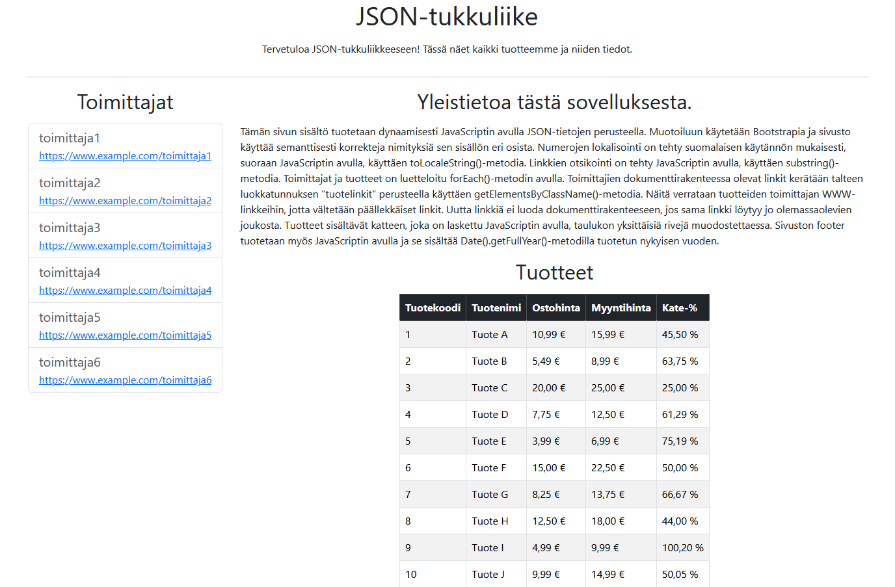

# JSON-tukkuliike

## 📸 Esikatselu

## 🔗 Live Demo

👉 https://thermopylai.github.io/Json-tukkuliike/json-tukkuliike.html

---

## 📖 Kuvaus

Tämä projekti esittelee yksinkertaisen tukkuliikkeen tuoteselaimen, jossa sisältö tuotetaan dynaamisesti **JavaScriptin** avulla **JSON-datan** perusteella.

Sivulla näytetään:
- tuotteet taulukkomuodossa
- toimittajien www-linkit ilman duplikaatteja

Ulkoasussa hyödynnetään **Bootstrapia**, ja rakenne on toteutettu semanttisilla HTML-elementeillä.

---

## ⚙️ Toteutus

Projektissa on käytetty seuraavia keskeisiä tekniikoita:

- JSON-data muunnetaan JavaScript-objektiksi `JSON.parse()`-metodilla
- Tuotetaulukko luodaan dynaamisesti DOMiin
- Kate-% lasketaan jokaiselle tuotteelle JavaScriptillä
- Numerot lokalisoidaan suomalaisittain `toLocaleString()`-metodilla
- Toimittajalinkit luodaan ilman duplikaatteja tarkistamalla olemassa olevat linkit `getElementsByClassName()`-metodilla
- Sivun footer luodaan JavaScriptillä ja sisältää kuluvan vuoden (`Date().getFullYear()`)

---

## 🎯 Projektin tarkoitus

Projektin tavoitteena oli harjoitella:

- DOM-manipulaatiota ja elementtien hakua
- dynaamisen sisällön luontia JavaScriptillä
- JSON-datan käsittelyä (`JSON.parse()`)
- laskennallisten arvojen esittämistä (kate-%)
- listojen ja taulukoiden luontia (`forEach()`)
- duplikaattien käsittelyä DOMissa
- numeroiden lokalisointia (`toLocaleString()`)
- Bootstrapin käyttöä käyttöliittymän muotoilussa

---

## 🧱 Teknologiat

- **HTML5**
- **JavaScript (ES6)**
- **Bootstrap 5.3**

---

## 📁 Projektin rakenne

Sovellus on toteutettu yhdessä HTML-tiedostossa, joka sisältää:

- HTML-rakenteen
- Bootstrap-tyylit
- JavaScript-logiikan

---

## 👤 Tekijä

**Lauri Tikkanen**

GitHub: [Thermopylai](https://github.com/Thermopylai)